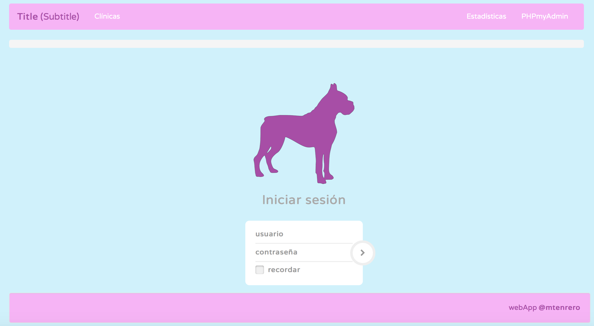
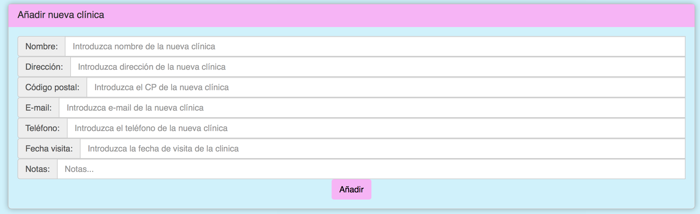
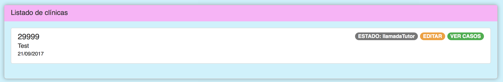
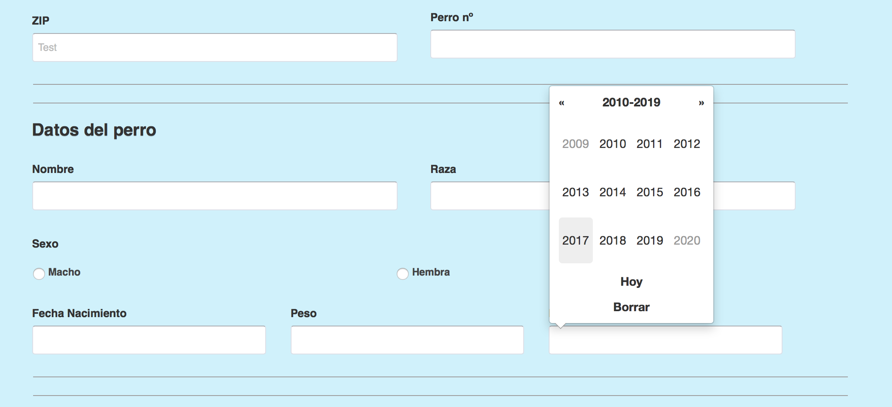

# abVetStudy
This WebApp used in antimicrobials resistance study in veterinary medicine in the city of Madrid.

## Description

This webApp is developed for store clinical data of animals who had treatments with antimicrobial medicines in a mySQL/MariaDB relational database. 

### Data Storage

An area or ZIP code should be entered in order to store data of the animals, because they are intended to be related with a specific area code. Later, you can start to collect the data using the forms. 

## Technical Information

### Tech

This webApp is made with nodeJS, Express, Sequelize and CofeeScript as traditional monolithic application due to its simplicity.

### User Handling

You can add/remove users from a JSON configuration file placed in ./authentication/userfile.json

The users can be restricted to view only a specified zip data if the zip is greater than 0 or they also can be admins and view the entire data collection if they are configured with the zip 0.

### DB Structure

Clinica -> Perro (1:N) -> Diagnostico (1:1) -> Tratamiento (1:N)

## Current Errors / Improvements planned

    * Update a registry is buggy, so they could not be updated correctly
    * Multiple request can cause to store the entry twice
    * There aren't a delete button for an entry
    * Responsive UI

NOTE: Feel free to open an Issue or make a PR if you solve something or if you have some improvements.

## Deployment

The app is Dockerized and can be launched with Docker in any computer/server.

Also you can deploy it with the traditional method, the only you need is:

    * NodeJS
    * NPM Dependencies
    * A mariaDB/mySQL database instance working with a database & user already created

On the application start you can specify some envs:

    * DB_PORT
    * DB_HOST
    * DB_USER
    * DB_PASS
    * DB_NAME

`node bin/www` is the command to launch the webapp.

App exposes the port 80 by default in the Docker image and the port 3000 (development) wit the node start method.

NOTE: Use with PM2 for running the webApp forever.
